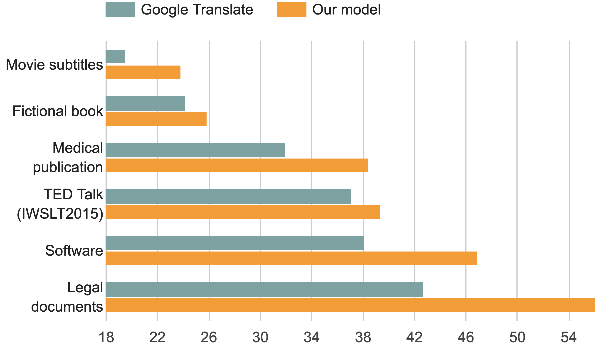
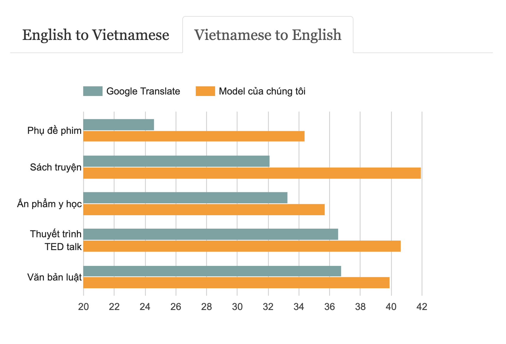

# MTet: Multi-domain Translation for English-Vietnamese

### Release
- [v2.0 (Current)](https://github.com/vietai/mTet)
- [v1.0](https://github.com/vietai/SAT/releases/tag/v1.0)

### Introduction

We are excited to introduce a new larger and better quality Machine Translation dataset, **MTet**, which stands for **M**ulti-domain **T**ranslation for **E**nglish and Vie**T**namese. In our new release, we extend our previous dataset ([v1.0](https://github.com/vietai/SAT/releases/tag/v1.0)) by adding more high-quality English-Vietnamese sentence pairs on various domains. In addition, we also show our new larger Transformer models can achieve state-of-the-art results on multiple test sets.

<!-- **English to Vietnamese Translation (BLEU score)**

**Vietnamese to English Translation (BLEU score)**

 -->

Get data and model at [Google Cloud Storage](https://console.cloud.google.com/storage/browser/vietai_public/best_vi_translation/v2)

Visit our [blog post](http://translate.vietai.org/) for more details.

 

### Using the code
This code is build on top of [vietai/dab](https://github.com/vietai/dab):

To prepare for training, generate `tfrecords` from raw text files:

<prev>

    python t2t_datagen.py \
    --data_dir=$path_to_folder_contains_vocab_file \
    --tmp_dir=$path_to_folder_that_contains_training_data \
    --problem=$problem
</prev>

To train a Transformer model on the generated `tfrecords`

<prev>

    python t2t_trainer.py \
    --data_dir=$path_to_folder_contains_vocab_file_and_tf_records \
    --problem=$problem \
    --hparams_set=$hparams_set \
    --model=transformer \
    --output_dir=$path_to_folder_to_save_checkpoints
</prev>

To run inference on the trained model:

<prev>

    python t2t_decoder.py \
    --data_dir=$path_to_folde_contains_vocab_file_and_tf_records \
    --problem=$problem \
    --hparams_set=$hparams_set \
    --model=transformer \
    --output_dir=$path_to_folder_contains_checkpoints \
    --checkpoint_path=$path_to_checkpoint
</prev>

In [this colab](https://colab.research.google.com/drive/1LH4wO7LcrklrUGwaMdLlXpJJcu2opGK6?usp=sharing), we demonstrated how to run these three phases in the context of hosting data/model on Google Cloud Storage.

 

### Dataset

Our data contains roughly 4.2 million pairs of texts, ranging across multiple different domains such as medical publications, religious texts, engineering articles, literature, news, and poems. A more detail breakdown of our data is shown in the table below.

<table align="center">
<thead>
<tr>
<th></th>
<th>v1</th>
<th>v2 (MTet)</th>
</tr>
</thead>

<tbody>
<tr>
<td>Fictional Books</td>
<td style="text-align:right;">333,189</td>
<td style="text-align:right;">473,306</td>
</tr>

<tr>
<td>Legal Document</td>
<td style="text-align:right;">1,150,266</td>
<td style="text-align:right;">1,134,813</td>
</tr>

<tr>
<td>Medical Publication</td>
<td style="text-align:right;">5,861</td>
<td style="text-align:right;">13,410</td>
</tr>

<tr>
<td>Movies Subtitles</td>
<td style="text-align:right;">250,000</td>
<td style="text-align:right;">721,174</td>
</tr>

<tr>
<td>Software</td>
<td style="text-align:right;">79,912</td>
<td style="text-align:right;">79,132</td>
</tr>

<tr>
<td>TED Talk</td>
<td style="text-align:right;">352,652</td>
<td style="text-align:right;">303,131</td>
</tr>

<tr>
<td>Wikipedia</td>
<td style="text-align:right;">645,326</td>
<td style="text-align:right;">1,094,248</td>
</tr>

<tr>
<td>News</td>
<td style="text-align:right;">18,449</td>
<td style="text-align:right;">18,389</td>
</tr>

<tr>
<td>Religious texts</td>
<td style="text-align:right;">124,389</td>
<td style="text-align:right;">48,927</td>
</tr>

<tr>
<td>Educational content</td>
<td style="text-align:right;">397,008</td>
<td style="text-align:right;">213,284</td>
</tr>

<tr>
<td>No tag</td>
<td style="text-align:right;">5,517</td>
<td style="text-align:right;">63,896</td>
</tr>

<tr>
<td>Total</td>
<td style="text-align:right;">3,362,569</td>
<td style="text-align:right;">4,163,710</td>
</tr>

</table>

 

Data sources is described in more details [here](https://github.com/vietai/SAT/blob/main/data_distribution.txt).

### Acknowledgment
We would like to thank Google for the support of Cloud credits and TPU quota!
