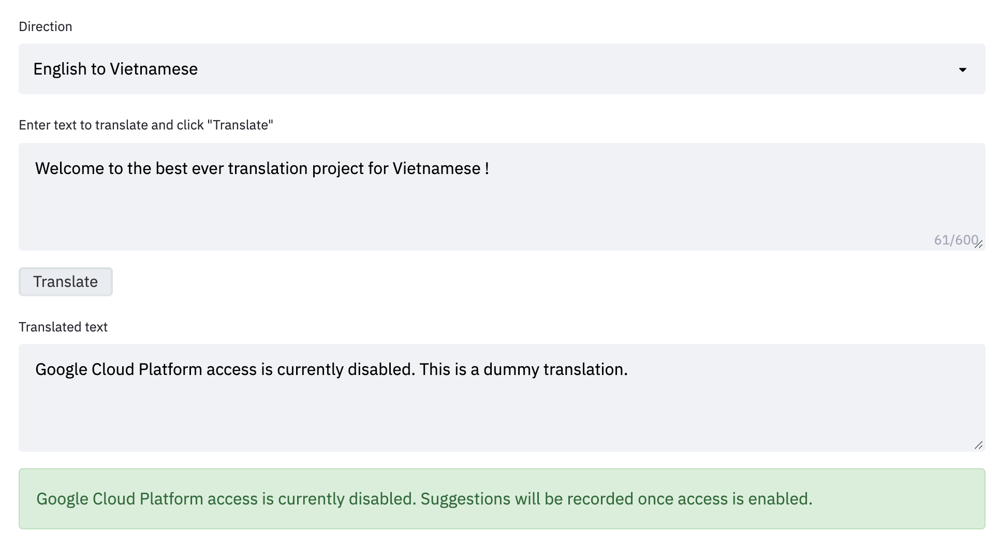

**This is a guide on how to contribute to [VietAI Translate web app demo](https://demo.vietai.org/).**

0. Install [docker](https://docs.docker.com/get-docker/) and python package [virtualenv](https://pypi.org/project/virtualenv/).

1. Clone this Github repository

```
git clone https://github.com/vietai/sat.git
cd sat/translation_web_app
```

2. Create and active a virtual environment

```
pip install virtualenv
virtualenv <ENV-NAME>
source <ENV-NAME>/bin/activate
```

3. Intall requirement dependencies
```
pip install -r requirement.txt
```

4. Use Streamlit to start the local web app.
```
streamlit run app.py
```

At this point, you are already running a local version of our Web App. However, there will be no access to our Machine Learning model and Firebase database hosted on Google Cloud Platform:




Regardless, you can still make cosmetic changes to the front-end component of the web app and submit pull requests, all API calls will return a placeholder output as shown above.

To interact with the Machine Learning model and Firebase database hosted on GCP, one would need to generate their access key to VietAI's resources. Feel free to contact ngokieuchinh89@gmail.com if there is a need for this.


---


For a general tutorial on how to build your own web application with Machine Learning models hosted on Google Cloud Platform, please refer to [mrdbourke/cs329s-ml-deployment-tutorial](https://github.com/mrdbourke/cs329s-ml-deployment-tutorial).
